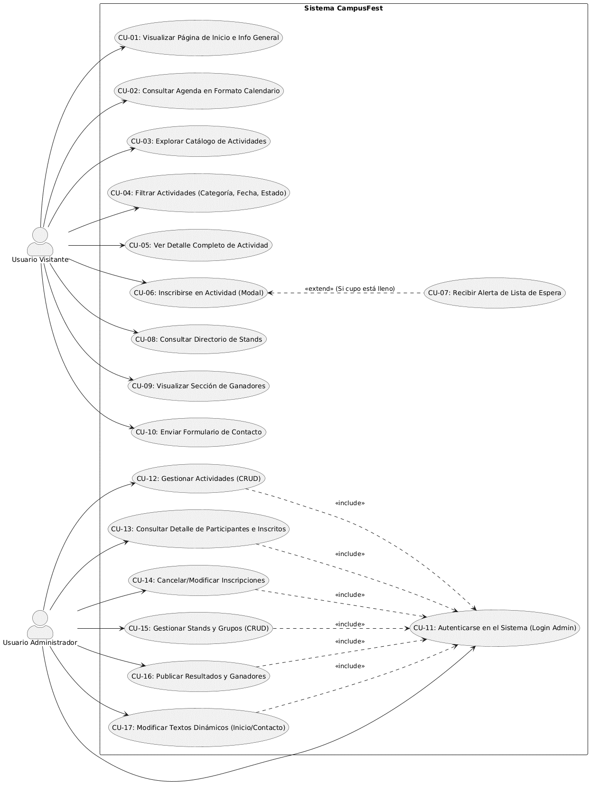
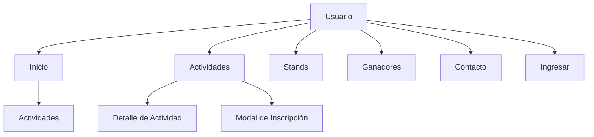
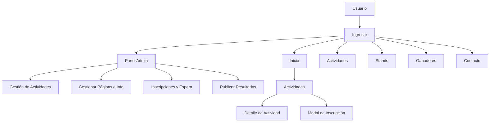

# Sitio Web CampusFest

Aplicación web full stack para la gestión del festival estudiantil CampusFest.
Desarrollada para "Proyecto Integrador I" de la Universidad CENFOTEC.

## Equipo
- **Bryan Morales Cascante** — Desarrollador Principal

---

## Descripción General del Sistema

El presente proyecto consiste en el desarrollo de una aplicación web full stack diseñada para la gestión integral del festival estudiantil CampusFest. El sistema centralizará la administración de actividades, el control de inscripciones, la publicación de la agenda y la visualización de los stands y grupos participantes, con el fin de optimizar el proceso que actualmente se maneja de forma manual.

## Perfiles de Usuario y Actores Involucrados

El sistema contempla dos actores principales:

* **Usuario Visitante:** Actor del lado del cliente cuyo objetivo principal es consumir información y participar. Puede visualizar la información general del festival, explorar el catálogo de actividades, consultar la agenda, explorar los stands, ver la sección de ganadores y completar los formularios de inscripción para los eventos.
* **Usuario Administrador:** Actor con privilegios de gestión y mantenimiento. Es el único encargado de alimentar dinámicamente el sistema. Tiene la capacidad de crear, editar, cancelar y eliminar actividades o inscripciones; gestionar la información general de la página de inicio, contacto y stands; administrar todas las inscripciones y listas de espera; y publicar los resultados o reconocimientos del festival.

## Suposiciones, Dependencias y Restricciones Generales

* **Suposiciones:** Se asume que los usuarios visitantes poseen una conexión estable a internet y acceso a una cuenta de correo electrónico válida, la cual es indispensable para la validación de identidad y recepción de notificaciones de inscripción.
* **Dependencias:** La persistencia de los datos y el funcionamiento continuo del sistema dependen de la disponibilidad del servicio de base de datos en la nube (MongoDB Atlas).
* **Restricciones:** A nivel de diseño e interfaz de usuario, el desarrollo se encuentra estrictamente restringido a acatar al 100% los lineamientos visuales, tipografías y paletas de colores estipulados en el libro de marca institucional proporcionado por la clienta Verónica Mora durante la fase de levantamiento de requerimientos.

---

## Restricciones de Diseño e Implementación

El desarrollo del sistema CampusFest estará sujeto a un conjunto de restricciones técnicas y normativas de código diseñadas para garantizar la escalabilidad, mantenibilidad y calidad del software entregable.

### Tecnologías Obligatorias, Plataformas, Lenguajes y Frameworks

El sistema se construirá bajo una arquitectura web full stack utilizando estrictamente las siguientes tecnologías:

* **Capa de Presentación (Front-end):** Se utilizará HTML5 semántico, CSS3 y JavaScript. Para agilizar la construcción de la interfaz y garantizar un diseño responsivo, es obligatorio el uso del framework Bootstrap.
* **Capa de Lógica de Negocio (Back-end):** Se implementará un servidor utilizando el entorno de ejecución Node.js apoyado en el framework Express.js para la construcción de una API RESTful.
* **Capa de Persistencia de Datos (Base de Datos):** Se utilizará el motor NoSQL MongoDB, específicamente desplegado a través del servicio en la nube MongoDB Atlas.
* **Control de Versiones y Plataforma:** Se utilizará Git de forma local y el repositorio centralizado se alojará obligatoriamente en GitHub.

### Normativas y Estándares a Cumplir

El equipo de desarrollo deberá acatar los siguientes lineamientos para mantener una base de código limpia (Clean Code) y estructurada.

#### Convenciones de Nomenclatura y Formato de Código

* **Variables y Funciones:** Se utilizará la convención `camelCase` (ej. `getActivities()`, `availableSpots()`). Los nombres deben ser descriptivos y pronunciables, prohibiendo el uso de abreviaturas ambiguas o variables de una sola letra (excepto en contadores de ciclos `for`).
* **Clases y Modelos de BBDD:** Se utilizará `PascalCase` (ej. `ActivityModel`, `UserAdmin`).
* **Archivos y Directorios:** Se utilizará `kebab-case` para garantizar rutas web seguras y estandarizadas (ej. `activities-catalog.html`, `auth-controller.js`).
* **Idioma:** La interfaz gráfica y los mensajes dirigidos al usuario final estarán en español. El código fuente (nombres de variables, funciones, bases de datos) se escribirá priorizando el idioma inglés.

## Arquitectura y Convenciones de Git

### Estándares de Mensajes de Commit (Conventional Commits)

Todos los mensajes de commit deben seguir la estructura estándar: `tipo(contexto): descripción en minúscula`.

| Tipo | Propósito | Ejemplo |
| :--- | :--- | :--- |
| **`feat`** | Una nueva característica o lógica de negocio | `feat(auth): implement jwt token validation` |
| **`fix`** | Una corrección de errores o un fallo | `fix(db): resolve memory leak in connection pool` |
| **`docs`** | Cambios exclusivamente de documentación | `docs(readme): add project setup and ssh guide` |
| **`style`** | Formato, actualizaciones del linter, cambio de nombre de variables | `style(ui): format product table layout with prettier` |
| **`refactor`** | Optimización del código sin cambiar el comportamiento | `refactor(services): simplify item search algorithm` |
| **`chore`** | Tareas de mantenimiento, dependencias o configuración | `chore(deps): update dependencies in configuration file` |

### Modelo de Ramas y Flujo de Trabajo (Git Flow)

Se implementa una estrategia de ramas para separar el código estable, la integración activa y las tareas de desarrollo diario aisladas entre distintos puestos de trabajo.

| Rama | Clasificación | Ciclo de vida | Propósito |
| :--- | :--- | :--- | :--- |
| **`main`** | Producción | Permanente | Contiene código 100% estable y listo para producción. No se permiten confirmaciones directas. |
| **`develop`** | Integración | Permanente | El entorno principal para el desarrollo activo. Todas las tareas finalizadas se fusionan aquí. |
| **`feat/*`** | Característica | Temporal | Rama aislada a partir de `develop` para construir una única característica específica. |
| **`fix/*`** | Arreglo de errores | Temporal | Rama urgente a partir de `develop` para resolver un error o problema activo. |

#### Ciclo de Desarrollo Estándar

Cada vez que se inicie el trabajo en una nueva característica o se cambie de computadora, se deben seguir estos pasos en orden:

```bash
# Paso 1: Cambiar a develop y traer los últimos cambios de la nube
git checkout develop
git pull origin develop

# Paso 2: Crear una rama específica para la tarea a partir de develop
git checkout -b feat/nombre-de-la-caracteristica

# Paso 3: Trabajar en los archivos, agregarlos y confirmar usando el estándar
git add .
git commit -m "feat(contexto): descripción breve de los cambios"

# Paso 4: Subir la rama temporal a GitHub
git push origin feat/nombre-de-la-caracteristica
```

## Documentación del Proyecto

Toda la documentación, notas de levantamiento y requerimientos recopilados durante el ciclo de vida del proyecto se organizan dentro del directorio `docs/`:

*   [Entrevista con la clienta](./docs/client-interview.md) — Resumen de la sesión de levantamiento de requerimientos con Verónica Mora.
*   [Requisitos Funcionales](./docs/functional-requirements.md) — Backlog del producto, historias de usuario y criterios de aceptación.
*   [Requisitos No Funcionales](./docs/non-functional-requirements.md) — Restricciones del sistema, estándares de seguridad, métricas de rendimiento y configuración del stack tecnológico.
*   [Especificación de Requerimientos](./docs/ERS-ES.md) — Especificación de Requisitos de Software (ERS) y matriz de trazabilidad.

## Estructura de Directorios del Proyecto

```text
/campusfest
├── /docs                   # Documentación del proyecto (ERS, diagramas, manuales)
├── .env                    # Variables de entorno (credenciales de BD, puertos)
├── .gitignore              # Archivos ignorados por Git (node_modules, .env)
├── package.json            # Dependencias del proyecto (Express, Mongoose, etc.)
├── README.md               # Documentación principal del repositorio para GitHub
├── server.js               # Archivo principal: inicializa el servidor Express
│
├── /config                 # Configuración de servicios externos
│   └── db.js               # Lógica de conexión a MongoDB Atlas
│
├── /models                 # [M] MODELOS: esquemas de datos (Mongoose)
│   ├── Activity.js
│   ├── Enrollment.js
│   ├── Stand.js
│   ├── AdminUser.js
│   └── Configuration.js    # Textos dinámicos de inicio y contacto
│
├── /controllers            # [C] CONTROLADORES: lógica de negocio
│   ├── activityController.js
│   ├── enrollmentController.js
│   ├── standController.js
│   └── adminController.js
│
├── /routes                 # ENRUTADORES: definición de URLs y endpoints
│   ├── activities.js       # Rutas públicas del catálogo
│   ├── enrollments.js      # Rutas públicas de formularios
│   └── admin.js            # Rutas protegidas del backoffice
│
├── /middlewares            # INTERMEDIARIOS: filtros de seguridad
│   └── auth.js              # Valida si el usuario es administrador
│
├── /views                  # [V] VISTAS: archivos HTML del frontend
│   ├── home.html
│   ├── catalog.html
│   ├── detail.html
│   ├── contact.html
│   ├── stands.html
│   └── /admin               # Vistas exclusivas del panel de control
│       ├── dashboard.html
│       └── manage-activities.html
│
└── /public                 # ARCHIVOS ESTÁTICOS: recursos públicos del navegador
    ├── /css
    │   └── style.css        # Estilos personalizados y variables de modo oscuro
    ├── /img                 # Logotipos y banners institucionales
    └── /js                  # Lógica de front-end (Vanilla JS)
        ├── main.js          # Inicializador general
        ├── api.js           # Consumo de la API REST (Fetch)
        ├── ui.js            # Manipulación del DOM (tarjetas, modales)
        ├── filters.js       # Lógica de búsqueda y fechas
        └── validator.js     # Validaciones de formularios
```

### Justificación de la Arquitectura

La estructura de directorios adoptada refleja una estricta separación de responsabilidades basada en el patrón de diseño MVC.

* La capa de datos (colecciones de MongoDB) se aísla en el directorio `/models`.
* La lógica de negocio y validación de reglas operan exclusivamente en `/controllers`.
* La interfaz de usuario reside en `/views`, apoyada por recursos estáticos organizados modularmente en la carpeta `/public`.

Esta modularidad garantiza que el código Vanilla JS del cliente (`/public/js/`) esté separado por responsabilidades (UI, validación, consumo de API), evitando la aglomeración de código y facilitando su escalabilidad.

---

## 📋 Gestión del Proyecto (Espacio de Trabajo en Jira)

La planificación, seguimiento y gestión de este proyecto, incluyendo la definición de Épicas, Historias de Usuario y el backlog completo del producto, se centralizan en **Jira Software**.

El docente evaluador puede acceder al tablero oficial de CampusFest en Jira, revisar la trazabilidad de los requerimientos y monitorear el avance del desarrollo a través del siguiente enlace:

🔗 **[CampusFest - Tablero Oficial de Jira (Backlog y Épicas)](https://ucenfotec-bryan-proyecto-integrador-1.atlassian.net/?continue=https%3A%2F%2Fucenfotec-bryan-proyecto-integrador-1.atlassian.net%2Fwelcome%2Fsoftware%3FprojectId%3D10000&atlOrigin=eyJpIjoiNTJiNmMxYmFjNzRhNGFlNWEwN2M5ZGI1OTk0ZWIzODUiLCJwIjoiamlyYS1zb2Z0d2FyZSJ9)**

## Especificación de Diseño de Software

### Propósito y Alcance del Sistema

El propósito principal del sistema CampusFest es el desarrollo de una aplicación web full-stack diseñada para centralizar y automatizar la gestión integral del festival estudiantil de la Universidad CENFOTEC. El sistema busca reemplazar los procesos manuales actuales de administración mediante una plataforma centralizada que optimice la divulgación de la agenda, el control de inscripciones de participantes, la asignación a listas de espera, y la exposición de stands y grupos participantes.

#### Arquitectura, Base de Datos y Tecnologías Utilizadas

De acuerdo con las especificaciones técnicas obligatorias definidas para el proyecto, el sistema se ha estructurado bajo los siguientes componentes de software:

* **Arquitectura de Software:** Se implementa una arquitectura web full-stack guiada estrictamente por el patrón de diseño Modelo-Vista-Controlador (MVC). Esta modularidad separa de forma clara las colecciones de datos (`/models`), la lógica de negocio y sanitización (`/controllers`), y las interfaces de usuario (`/views`) con sus archivos estáticos del navegador (`/public`). El intercambio de información entre el cliente y el servidor se realiza mediante el consumo de una API RESTful utilizando intercambio de datos en formato JSON.
* **Base de Datos:** Se utiliza un motor NoSQL MongoDB, desplegado en la nube a través del servicio gestionado MongoDB Atlas, el cual garantiza la persistencia, disponibilidad continua y escalabilidad de los datos del festival.
* **Tecnologías del Back-end:** Servidor basado en el entorno de ejecución Node.js apoyado en el framework Express.js para la creación de endpoints y enrutamiento seguro. Las credenciales del administrador se protegen mediante algoritmos de hashing unidireccional con bcrypt, y la seguridad en accesos críticos es controlada por middlewares de autenticación.
* **Tecnologías del Front-end:** Interfaz construida con HTML5 semántico (utilizando etiquetas como `nav`, `main`, `section`, `footer`), CSS3 integrado con media queries personalizadas para el soporte nativo de modo oscuro, y lógica dinámica del lado del cliente mediante JavaScript (Vanilla JS). Se utiliza el framework Bootstrap de forma obligatoria para acelerar el desarrollo del diseño adaptativo y responsivo tanto en dispositivos móviles como de escritorio.

#### Alcance del Sistema

El alcance del prototipo funcional ha sido delimitado de manera estricta para asegurar un desarrollo controlado y evitar la expansión desmedida de funcionalidades (scope creep):

**Funcionalidades Incluidas (Dentro de Alcance):**

* **Módulo del Visitante:** Página de inicio interactiva con banner institucional, información general y sección dinámica con las 3 actividades destacadas (calculadas automáticamente según la menor disponibilidad de cupos). Catálogo visual de actividades en tarjetas que muestra estados de cupo simulados ("disponible", "lleno", "cancelado"), organizados cronológicamente, y con filtros múltiples combinados por fecha, categoría y estado temporal. Agenda diaria interactiva estilo calendario por horas.
* **Módulo de Inscripciones:** Formulario integrado en una ventana modal superpuesta de Bootstrap para la captura obligatoria de datos del usuario. Validación en el cliente mediante JavaScript para verificar campos vacíos y formatos de correo. Control de unicidad para impedir inscripciones duplicadas de un mismo correo en una misma actividad. Manejo automatizado de cupos que asigna al usuario a una lista de espera si la actividad está llena, con retroalimentación visual inmediata en pantalla y notificaciones simuladas por correo electrónico.
* **Módulo de Administración (Backoffice):** Panel de control seguro (`/admin`) con vistas y accesos restringidos para el Usuario Administrador mediante control de sesiones. Operaciones CRUD completas para registrar, editar y cancelar actividades; gestión y consulta detallada de listas de participantes inscritos y en lista de espera; privilegios exclusivos para cancelar o modificar inscripciones de usuarios; gestión del directorio de stands y grupos participantes; actualización dinámica de reconocimientos en la sección de ganadores; y modificación de textos dinámicos informativos en las páginas de inicio y contacto.

**Funcionalidades Excluidas (Fuera de Alcance):**

* Sistemas o pasarelas de pago integradas para las actividades.
* Sistemas de comunicación o chats en tiempo vivo dentro de la plataforma.
* Validaciones de identidad complejas por servicios externos de autenticación de terceros para usuarios visitantes.

---

### Modelado del Sistema: Diagrama de Casos de Uso

A nivel de modelado, el sistema identifica a dos actores clave que interactúan con las fronteras del sistema CampusFest: el Usuario Visitante y el Usuario Administrador.



#### Relación de Casos de Uso y Actores

1. **Usuario Visitante:** Actor del lado del cliente enfocado en consumir datos generales. Se asocia con los casos de uso de visualización general, uso de filtros avanzados, despliegue del formulario de inscripción mediante modales y visualización de stands y reconocimientos. El caso de uso *Inscribirse en Actividad* es extendido por el caso de uso *Recibir Alerta de Lista de Espera* si se cumple la condición de que los cupos simulados estén marcados como llenos.
2. **Usuario Administrador:** Actor con privilegios elevados. Todas sus interacciones clave de administración (CRUD de actividades, stands, control de inscripciones y edición de información estática de la interfaz) incluyen obligatoriamente la verificación previa y exitosa del caso de uso *Autenticarse en el Sistema* para salvaguardar la seguridad del backoffice.

---

### Interfaz de Usuario (UI/UX)

#### Wireframes o Prototipos de Baja/Alta Fidelidad

Se determinó realizar un prototipo de alta fidelidad con la herramienta Figma, el cual puede ser consultado en el siguiente enlace:

🔗 **[Prototipo de Alta Fidelidad - CampusFest](https://vocal-warm-64211069.figma.site/)**

### Guía de Estilos (Colores, Tipografía y Componentes)

#### Referencia de Implementación (CSS)
 
```css
/* ==================================================
   1. PALETA DE COLORES INSTITUCIONALES (MANUAL DE MARCA)
   ================================================== */
:root {
    /* --- Colores Primarios de Marca --- */
    --ucenfotec-blue-dark: #164a98;    /* C:100 M:83 Y:6 K:0 */
    --ucenfotec-blue-vibrant: #006aea; /* C:82 M:60 Y:0 K:0 */
    --ucenfotec-blue-light: #9cc8ff;   /* C:34 M:13 Y:0 K:0 */
    --ucenfotec-gray-light: #d2d2d2;   /* C:17 M:13 Y:13 K:0 */
    --ucenfotec-gray-dark: #7c7b75;    /* C:53 M:44 Y:49 K:11 */
 
    /* --- Colores Secundarios de Acento por Escuela --- */
    --school-systems: #2b93d1;      /* Information Systems */
    --school-cyber: #f05323;        /* Cybersecurity */
    --school-fundamentals: #4aa147; /* Computing Fundamentals */
    --school-software: #c81f66;     /* Software Engineering */
    --school-it: #c7ac19;           /* Information Technology */
    --school-affairs: #00928d;      /* Student Affairs */
    --school-intelligent: #00734a;  /* Intelligent Systems */
    --school-business: #d2232a;     /* Business Administration */
    --school-alumni: #712c86;       /* Alumni */
 
    /* --- Mapeo de Interfaz: MODO CLARO (Default) --- */
    --bg-primary: #ffffff;
    --bg-secondary: var(--ucenfotec-gray-light);
    --bg-surface: #f8f9fa;
    --text-main: #1a1a1a;
    --text-muted: var(--ucenfotec-gray-dark);
    --border-color: rgba(0, 0, 0, 0.1);
 
    /* Mapeo de Estados del Cupo (Simulación) */
    --status-disponible: var(--school-fundamentals); /* Verde para Disponible */
    --status-lleno: var(--school-cyber);              /* Rojo para Lleno */
    --status-cancelado: var(--ucenfotec-gray-dark);   /* Gris para Cancelado */
 
    /* Alertas de Retroalimentación */
    --alert-success: var(--school-fundamentals);
    --alert-warning: var(--school-it);
    --alert-error: var(--school-business);
}
 
/* --- Mapeo de Interfaz: MODO OSCURO NATIVO --- */
@media (prefers-color-scheme: dark) {
    :root {
        --bg-primary: #121212;
        --bg-secondary: #1e1e1e;
        --bg-surface: #252526;
        --text-main: #f5f5f5;
        --text-muted: #b0b0b0;
        --border-color: rgba(255, 255, 255, 0.15);
 
        --ucenfotec-blue-dark: #1f5cb8; /* Ajuste ligero de contraste para accesibilidad */
        --bg-surface-card: #202024;
    }
}
```

### Restricciones de Usabilidad y Accesibilidad
 
#### Usabilidad
 
* Diseño responsivo obligatorio (RNF-07/RNF-08): en escritorio, menú horizontal, tarjetas en varias columnas y formularios centrados; en móvil, menú colapsable, tarjetas en una sola columna y formularios a lo ancho de la pantalla.
* Área táctil mínima de 44x44 px para todos los botones en versión móvil (RNF-09).
* Modo oscuro obligatorio mediante media queries propias (RNF-10).
* Retroalimentación visual clara ante cualquier acción importante: confirmación de inscripción, error de validación, aviso de lista de espera (RNF-11, RNF-22).
* El formulario de inscripción debe conservar los datos ingresados si se pierde la conexión o falla el envío, evitando que el usuario deba volver a digitarlos (RNF-23).
* Los mensajes de error del servidor deben ser amigables, sin exponer trazas técnicas (RNF-18).
* El proceso de inscripción no debe sacar al usuario del catálogo (uso de modal superpuesto, RF-13).
* Cumplimiento estricto del libro de marca institucional (colores, tipografías, estilos) en toda la interfaz (RNF-06).
#### Accesibilidad
 
* Cumplimiento del criterio WCAG 2.4.7 (Focus Visible): todo elemento interactivo debe mostrar un indicador de foco claro al navegar con teclado (RNF-19).
* Atributo `alt` obligatorio y descriptivo en todas las imágenes del catálogo, stands y banners, para usuarios con discapacidad visual o conexiones lentas (RNF-20).
* Uso de etiquetas HTML5 semánticas (`nav`, `main`, `section`, `footer`) para facilitar la navegación por teclado y la lectura por lectores de pantalla (RNF-21).
* Ninguna notificación crítica (error de inscripción, cupo lleno, confirmación) puede depender solo de sonido; siempre debe ir acompañada de una alerta visual persistente hasta que el usuario la descarte (RNF-22).
* Contraste de color adecuado entre texto y fondo, respetando la paleta institucional.

### Diseño de Navegación
 
#### Flujo de Navegación - Usuario Visitante
 

 
#### Flujo de Navegación - Usuario Administrador
 

 
---


### Matriz de Trazabilidad

| ID Req. | Descripción Breve | Épica / Ticket Jira | Implementación (Componente / Módulo MVC) | Prototipo Correspondiente | Estado |
| :--- | :--- | :--- | :----- | :----- | :----- |
| **RF-01** | Estructura de Inicio y Menú | EPIC-01 / **CAMPUS-01** | `views/inicio.html`, `public/css/style.css` | Pantalla: Inicio | Por hacer ⚫ |
| **RF-02, RF-03** | 3 Actividades destacadas dinámicas | EPIC-01 / **CAMPUS-02** | `controllers/inicioController.js`, `models/Actividad.js` | Pantalla: Inicio (sección destacados) | Por hacer ⚫ |
| **RF-04** | Agenda formato calendario | EPIC-01 / **CAMPUS-06** | `views/catalogo.html`, `public/js/agenda.js` | Pantalla: Catálogo (bloque superior) | Por hacer ⚫ |
| **RF-05** | Catálogo en tarjetas visuales | EPIC-01 / **CAMPUS-07** | `views/catalogo.html`, `public/js/ui.js` | Pantalla: Catálogo | Por hacer ⚫ |
| **RF-06** | Detalle completo de actividad | EPIC-01 / **CAMPUS-08** | `controllers/actividadController.js`, `views/detalle.html` | Pantalla: Detalle de Actividad | Por hacer ⚫ |
| **RF-07** | Estado visual del cupo (lleno/disp) | EPIC-01 / **CAMPUS-12** | `public/js/ui.js` (Lógica de renderizado DOM) | Pantalla: Catálogo (tarjetas) | Por hacer ⚫ |
| **RF-08** | Filtrado múltiple (>8 hrs, cat, fecha) | EPIC-01 / **CAMPUS-13** | `routes/actividades.js`, `public/js/filtros.js` | Pantalla: Catálogo (panel de filtros) | Por hacer ⚫ |
| **RF-09** | Ordenamiento cronológico automático | EPIC-01 / **CAMPUS-14** | `controllers/actividadController.js` (Query sort) | Pantalla: Catálogo | Por hacer ⚫ |
| **RF-10** | Directorio de stands y grupos | EPIC-01 / **CAMPUS-15** | `views/stands.html`, `controllers/standController.js` | Pantalla: Stands | Por hacer ⚫ |
| **RF-11** | Página y formulario de contacto | EPIC-01 / **CAMPUS-16** | `views/contacto.html`, `routes/contacto.js` | Pantalla: Contacto | Por hacer ⚫ |
| **RF-12** | Sección de resultados y ganadores | EPIC-01 / **CAMPUS-17** | `views/ganadores.html`, `models/Resultado.js` | Pantalla: Ganadores | Por hacer ⚫ |
| **RF-13** | Modal superpuesto de inscripción | EPIC-02 / **CAMPUS-18** | `views/catalogo.html` (Bootstrap Modal), `public/js/main.js` | Pantalla: Modal de Inscripción | Por hacer ⚫ |
| **RF-14, RF-15** | Captura obligatoria y validación JS | EPIC-02 / **CAMPUS-19** | `public/js/validator.js` (Frontend) | Pantalla: Modal de Inscripción | Por hacer ⚫ |
| **RF-16** | Unicidad de correo para evitar duplicados | EPIC-02 / **CAMPUS-20** | `controllers/inscripcionController.js` (Backend) | Pantalla: Modal de Inscripción (validación) | Por hacer ⚫ |
| **RF-17** | Confirmación visual y por correo | EPIC-02 / **CAMPUS-21** | `public/js/ui.js`, Servicio Nodemailer | Pantalla: Modal de Inscripción (mensaje éxito) | Por hacer ⚫ |
| **RF-18, RF-19** | Asignación y alerta de lista de espera | EPIC-02 / **CAMPUS-22** | `models/Inscripcion.js`, `controllers/inscripcionController.js` | Pantalla: Modal de Inscripción (mensaje espera) | Diseñado 🟡 |
| **RF-20** | CRUD de actividades por administrador | EPIC-03 / **CAMPUS-23** | `views/admin-actividades.html`, `routes/admin.js` | Panel Admin — Gestión de Actividades | Diseñado 🟡 |
| **RF-21** | Consulta detallada de participantes | EPIC-03 / **CAMPUS-24** | `controllers/adminController.js`, `views/admin-inscritos.html` | Panel Admin — Inscripciones y Espera | Diseñado 🟡 |
| **RF-22** | Privilegios exclusivos de cancelación | EPIC-03 / **CAMPUS-25** | `middlewares/auth.js`, `routes/admin.js` | Panel Admin — Inscripciones y Espera | Diseñado 🟡 |
| **RF-23** | Gestión (CRUD) de Stands y Grupos | EPIC-03 / **CAMPUS-26** | `controllers/adminStandController.js` | Panel Admin — Páginas e Info (Info. de Stands) | Diseñado 🟡 |
| **RF-24** | Publicación de resultados/ganadores | EPIC-03 / **CAMPUS-27** | `models/Resultado.js`, `views/admin-ganadores.html` | Panel Admin — Publicar Resultados | Diseñado 🟡 |
| **RF-25** | Modificación de textos dinámicos | EPIC-03 / **CAMPUS-28** | `models/Configuracion.js`, `controllers/adminController.js` | Panel Admin — Páginas e Info (Inicio/Contacto) | Diseñado 🟡 |
| **RNF (TODOS)** | Estructuración, BD y Entornos | SPRINT 1 / **CAMPUS-02** | `server.js`, `config/db.js`, Repositorio GitHub | — | Completado 🟢 |
